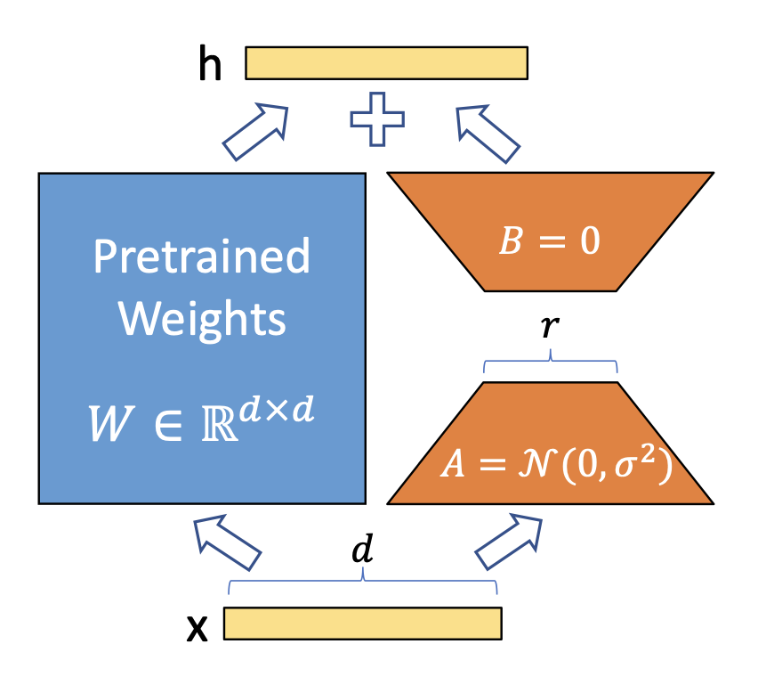
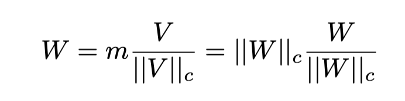
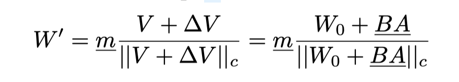
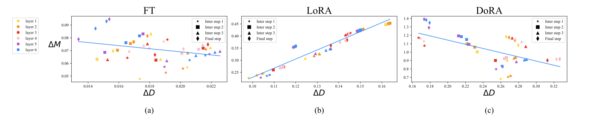

<h1 align="center">
    <p> DoRA: Weight-Decomposed Low-Rank Adaptation <br></p>
</h1>

<h1 align="center"> 
    
</h1>

[[`Paper`](https://arxiv.org/abs/2402.09353)] [[`Website`](https://nbasyl.github.io/DoRA-project-page/)]  [[`BibTeX`](#citation)]


# Introduction

Q1: Do you know what's the most popular way to train large language models on consumer-grade devices? 

Parameter-efficient fine-tuning has become essential in recent years, making the training of large models more accessible and computationally feasible. Among these methods, [[LoRA](https://arxiv.org/pdf/2106.09685)] (Low Rank Adaptation) has gained significant traction.

**Problem**: Despite its advantages, LoRA can still fall short in learning effectiveness compared to full fine-tuning (FT) of models.

**Solution - DoRA**: The DoRA approach decomposes pre-trained weights into two components: *magnitude* and *direction*. It leverages LoRA specifically for directional updates, reducing the number of trainable parameters needed for effective fine-tuning. By focusing on directional updates, DoRA enhances both the learning capacity and stability of LoRA without introducing additional inference overhead.

DoRA demonstrates superior performance over LoRA in fine-tuning models like LLaMA, LLaVA, and VL-BART across various downstream tasks, including commonsense reasoning, visual instruction tuning, and image/video-text understanding.


# Context: LoRA and is limitations
### How LoRA Works

<h1 align="center"> 
    
</h1>


LoRA (Low Rank Adaptation) is a parameter-efficient fine-tuning technique that modifies only a small subset of model weights during training. Instead of updating the entire weight matrix, LoRA introduces low-rank matrices that adapt the weight direction with minimal parameter changes. This approach significantly reduces the number of trainable parameters, making fine-tuning less resource-intensive.

Q2: What does rank do? What does it mean to have a higher/smaller rank? 

**LoRA Pseudo Code**:

```python
# Pseudo code for applying LoRA to a pre-trained model weight matrix W
# Original weight matrix: W ∈ R^(d_out x d_in)

# Define low-rank matrices A and B, where rank r << min(d_out, d_in)
A = nn.Parameter(torch.randn(d_out, r))  # Low-rank matrix A
B = nn.Parameter(torch.randn(r, d_in))   # Low-rank matrix B

# Forward pass with LoRA adaptation
def forward(X):
    # X: Input to the model
    return W @ X + (A @ B) @ X  # Original weight W plus low-rank adaptation
```

During fine-tuning, only A and B are updated, while W remains frozen.

# DoRA Decomposition

DoRA (Decomposition of Rank Adaptation) addresses the limitations of LoRA by decomposing pre-trained weights into two distinct components: **magnitude** and **direction**. Instead of directly adapting all parameters, DoRA uses LoRA to update only the *directional* component. This approach allows for efficient parameter updates that maximize learning capacity while preserving training stability and minimizing computational overhead.

## How DoRA Works

<h1 align="center"> 
    
</h1>

### **Weight Decomposition**: 
The pre-trained weight matrix \( W \) is decomposed into two parts:
   - **Magnitude**: Captures the overall scale of weights, which remains fixed.
   - **Direction**: Represents the adaptive component, where LoRA is applied for fine-tuning.

<h1 align="center"> 
    
</h1>

 where m ∈ R 1×k is the magnitude vector, V ∈ R d×k is the directional matrix, with || · || c being the vector-wise norm of a matrix across each column. This decomposition ensures that each column of V/ || V || c remains a unit vector, and the corresponding scalar in m defines the magnitude of each vector.

```python
# Assume W is the pre-trained weight matrix
# Step 1: Decompose W into magnitude (|W|) and direction (W/|W|) components
magnitude = torch.norm(W, dim=1, keepdim=True)  # Calculate the magnitude
direction = W / magnitude  # Normalize to get direction

# Step 2: Initialize low-rank matrices A and B for directional updates
A = nn.Parameter(torch.randn(direction.size(0), r))  # Low-rank matrix A
B = nn.Parameter(torch.randn(r, direction.size(1)))  # Low-rank matrix B

# Step 3: Fine-tune by updating direction with LoRA while keeping magnitude fixed
def forward(X):
    # Apply the fixed magnitude and updated direction for fine-tuning
    adaptive_direction = direction + (A @ B)  # LoRA updates applied to direction
    return (magnitude * adaptive_direction) @ X  # Final weighted output with fixed magnitude

# During training, only A and B are updated, keeping W's magnitude and the core direction structure fixed.
```
where:
- \( X \) represents the input activations,
- \( W \) is the pre-trained weight matrix,
- \( A \) and \( B \) are low-rank matrices used for efficient fine-tuning.


### **Updates During Training**: 
LoRA is employed specifically to update the directional component of \( W \), while the magnitudes are trained seperated as a lone column vector.

<h1 align="center"> 
    
</h1>

where ∆V is the incremental directional update learned by multiplying two low-rank matrices B and A, and the underlined parameters denote the trainable parameters. The matrices B ∈ R d×r and A ∈ R r×k are initialized in line with LoRA’s strategy to ensure that W ′ equals W 0 before the finetuning.


# LoRA vs Dora

<h1 align="center"> 
    
</h1>

Magnitude and direction updates of (a) FT, (b) LoRA, and (c) DoRA of the query matrices across different layers and intermediate steps. Different markers represent matrices of different training steps and different colors represent the matrices of each layer.

- FT: Downward Slope dM vs dD, high variance (Varied learning pattern with a relatively negative slope)
- Lora: Upward Slope dm vs dD, low variance (Proportional relationship between the changes in direction and magnitud)
- Dora: Downward Slope dM vs dD, high variance (similar to FT pattern)


## DoRA vs LoRA on the commonsense reasoning tasks 
| Model                 | r |    BoolQ  |  PIQA  |  SIQA  |  HellaS  |  WinoG  |  ARC-e  |  ARC-c  |  OBQA  |  Average  |
|-----------------------|-------|---------|--------|--------|-------------|--------------|---------|---------|--------|-----------|
| LLaMA-7B-LoRA		  |   32  |    67.5  |  80.8  |  78.2  |  83.4  |  80.4   |  78.0   |  62.6   |  79.1  |  76.3     |
| LLaMA-7B-DoRA	  |  [16](https://huggingface.co/sliuau/DoRA-weights/tree/main/llama_dora_commonsense_checkpoints/LLama-7B/dora_r16)   |    70.0 | 82.6 | 79.7 | 83.2 | 80.6 | 80.6 | 65.4 | 77.6 | **77.5**   |
| LLaMA-7B-DoRA 	  |  [32](https://huggingface.co/sliuau/DoRA-weights/tree/main/llama_dora_commonsense_checkpoints/LLama-7B/dora_r32)   |   69.7 | 83.4 | 78.6 | 87.2 | 81.0 | 81.9 | 66.2 | 79.2 | **78.4**   |
| LLaMA2-7B-LoRA		  |   32  |   69.8 | 79.9| 79.5| 83.6| 82.6| 79.8|64.7| 81.0| 77.6    |
| LLaMA2-7B-DoRA		  |  [16](https://huggingface.co/sliuau/DoRA-weights/tree/main/llama_dora_commonsense_checkpoints/LLama2-7B/dora_r16)   |   72.0 |83.1 |79.9| 89.1 |83.0| 84.5| 71.0 |81.2 |**80.5**  |
| LLaMA2-7B-DoRA 	  |  [32](https://huggingface.co/sliuau/DoRA-weights/tree/main/llama_dora_commonsense_checkpoints/LLama2-7B/dora_r32)   |  71.8 |83.7 |76.0 |89.1 |82.6 |83.7 |68.2| 82.4 |**79.7**   |
| LLaMA3-8B-LoRA		  |   32  |   70.8 |85.2| 79.9| 91.7 |84.3 |84.2| 71.2| 79.0| 80.8    |
| LLaMA3-8B-DoRA		  |  [16](https://huggingface.co/sliuau/DoRA-weights/tree/main/llama_dora_commonsense_checkpoints/LLama3-8B/dora_r16)   |  74.5 |88.8 |80.3| 95.5| 84.7| 90.1| 79.1| 87.2| **85.0**   |
| LLaMA3-8B-DoRA 	  |  [32](https://huggingface.co/sliuau/DoRA-weights/tree/main/llama_dora_commonsense_checkpoints/LLama3-8B/dora_r32)   |   74.6| 89.3| 79.9 |95.5| 85.6| 90.5| 80.4 |85.8 |**85.2**  |

DoRA enhances the learning capability of LoRA, thereby reducing the need for a higher rank to surpass LoRA in terms of accuracy.


### Critical Analysis: 

- Dora leads to slightly more paramaters than Lora due to the matrix decomposition and training magnitude and direction saperately.
- Author didn't show direct benchmark other than language models (i.e. vision models, and multimodal modals).


# Useful Links
The Official PyTorch implementation of [**DoRA: Weight-Decomposed Low-Rank Adaptation**](https://arxiv.org/abs/2402.09353) 
